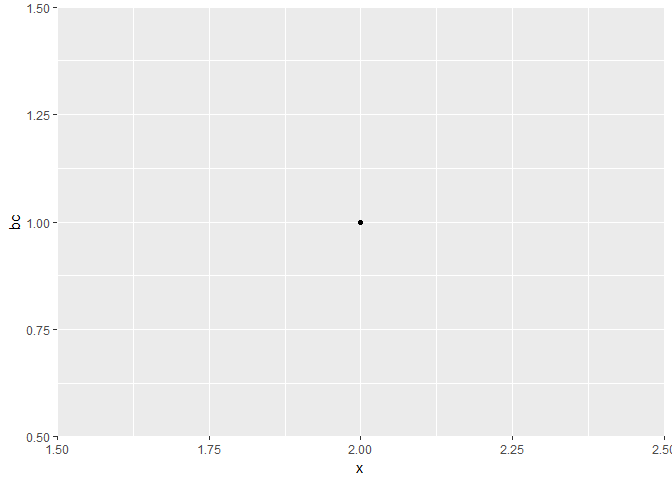

<!-- README.md is generated from README.Rmd. Please edit that file -->
**Note**: This R package is not mean to be "serious". It's just for homework.

`WZZ`
=====

This is an R package that gives `sqrt()` friends by providing other power functions. It also helps do BoxCox transformation/ BoxCox inverse transformation.

Installation
------------

You can install powers from github with:

``` r
# install.packages("devtools")
devtools::install_github("wenzhengzzz/STAT547-hw09-Zhou-Wenzheng")
#> Skipping install of 'WZZ' from a github remote, the SHA1 (2db37d93) has not changed since last install.
#>   Use `force = TRUE` to force installation
```

Functions
---------

-   suqare(x, plot.it=FALSE) is used to take suqare of a vector x, it can be logicals and nuumbers. There is an option to plot the vector vs returned values.

-   cube(x, plot.it=FALSE) is used to cube a vector x, it can be logicals and nuumbers. There is an option to plot the vector vs returned values.

-   BoxCox(x,lambda,plot.it=F,omit.na=T) is used to do BoxCox transformation of a vector x, it can be logicals and nuumbers. There is an option to plot the vector vs returned values and omit NA in the data.

-   BoxCox.inv(x,lambda,plot.it=F,omit.na=T) is used to do inverse BoxCox transformation of a vector x, it can be logicals and nuumbers. There is an option to plot the vector vs returned values and omit NA in the data.

Example
-------

See the vignette for more extensive use, but here's some examples:

``` r
WZZ::square(2,F)
#> [1] 4
WZZ::cube(c(2,3))
#> [1]  8 27
WZZ::BoxCox(2,1,T)
```



    #> [1] 1
    WZZ::BoxCox.inv(2,1)
    #> [1] 3

For Developers
--------------

(Again, I don't actually intend for anyone to develop this silly package, but if I did, here's what I'd write.)

Use the internal `pow` function as the machinery for the front-end functions such as `square`and `cube`.
